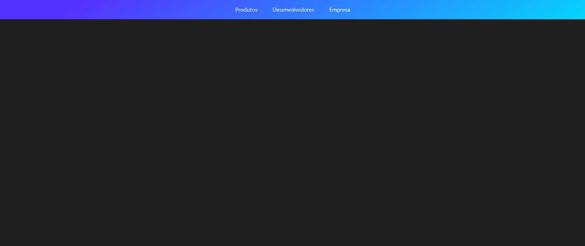

# UI Clone <a href="https://stripe.com/br">Stripe</a> menu

<h3>
    Acompanhei o vídeo da playlist UI Clone no canal da Rocketseat para realizar o clone desse menu.
    <a href="https://www.youtube.com/watch?v=B7V0q0ZSz2o&list=PL85ITvJ7FLohTZv9cC5-PrZ39Q3cugWqp&index=11">Clique aqui para conferir o vídeo</a>
</h3>

<h3>Ministrado por <a href="https://github.com/guilhermerodz">Guilherme Rodz</a></h3>

<h3><a href="https://github.com/rocketseat-content/youtube-clone-stripe-menu">Repositório no github da Rocketseat</a></h3>

# Tecnologias

<ul>
    <li>ReactJS</li>
    <li>Styled Components</li>
    <li>Framer Motion</li>
</ul>

# Instalação

<strong>
  Será necessários algumas ferramentas: <a href="https://git-scm.com/">Git</a>, <a href="https://nodejs.org/en/">Node.js</a>,
  nesse projeto utilizei um instalador de pacotes diferente, caso queira usá-lo <a href="https://yarnpkg.com/">Yarn</a>.
</strong>

 

<strong>
  Para clonar o projeto usando HTTPS, use esse comando:
</strong>

<pre>
  git clone https://github.com/pdrolucasz/clone-stripe-menu.git
</pre>

<strong>Navegue até a pasta do projeto e instale as dependências usando esse comando: </strong>

<pre>
  yarn
  ou
  npm install 
</pre>

<strong>Para iniciar a aplicação em ambiente de desenvolvimento, utilize esse comando:</strong>

<pre>
  # http://localhost:3000/
  yarn start

  npm run start
</pre>

#

<h3 align="center"> Confira meu <a href="https://www.linkedin.com/in/pedro-lucas-4b2941199/">Linkedin</a></h3>